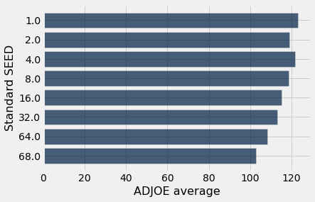

```python
from datascience import *
import numpy as np
import pandas as pd

%matplotlib inline
import matplotlib.pyplot as plots
plots.style.use('fivethirtyeight')
```


```python
pwd
```


    'C:\\Users\\guophie\\SAIL Application'


```python
cbb: Table = Table.read_table('cbb.csv')
cbb
```


<table border="1" class="dataframe">
    <thead>
        <tr>
            <th>TEAM</th> <th>CONF</th> <th>G</th> <th>W</th> <th>ADJOE</th> <th>ADJDE</th> <th>BARTHAG</th> <th>EFG_O</th> <th>EFG_D</th> <th>TOR</th> <th>TORD</th> <th>ORB</th> <th>DRB</th> <th>FTR</th> <th>FTRD</th> <th>2P_O</th> <th>2P_D</th> <th>3P_O</th> <th>3P_D</th> <th>ADJ_T</th> <th>WAB</th> <th>POSTSEASON</th> <th>SEED</th> <th>YEAR</th>
        </tr>
    </thead>
    <tbody>
        <tr>
            <td>North Carolina</td> <td>ACC </td> <td>40  </td> <td>33  </td> <td>123.3</td> <td>94.9 </td> <td>0.9531 </td> <td>52.6 </td> <td>48.1 </td> <td>15.4</td> <td>18.2</td> <td>40.7</td> <td>30  </td> <td>32.3</td> <td>30.4</td> <td>53.9</td> <td>44.6</td> <td>32.7</td> <td>36.2</td> <td>71.7 </td> <td>8.6 </td> <td>2ND       </td> <td>1   </td> <td>2016</td>
        </tr>
        <tr>
            <td>Wisconsin     </td> <td>B10 </td> <td>40  </td> <td>36  </td> <td>129.1</td> <td>93.6 </td> <td>0.9758 </td> <td>54.8 </td> <td>47.7 </td> <td>12.4</td> <td>15.8</td> <td>32.1</td> <td>23.7</td> <td>36.2</td> <td>22.4</td> <td>54.8</td> <td>44.7</td> <td>36.5</td> <td>37.5</td> <td>59.3 </td> <td>11.3</td> <td>2ND       </td> <td>1   </td> <td>2015</td>
        </tr>
        <tr>
            <td>Michigan      </td> <td>B10 </td> <td>40  </td> <td>33  </td> <td>114.4</td> <td>90.4 </td> <td>0.9375 </td> <td>53.9 </td> <td>47.7 </td> <td>14  </td> <td>19.5</td> <td>25.5</td> <td>24.9</td> <td>30.7</td> <td>30  </td> <td>54.7</td> <td>46.8</td> <td>35.2</td> <td>33.2</td> <td>65.9 </td> <td>6.9 </td> <td>2ND       </td> <td>3   </td> <td>2018</td>
        </tr>
        <tr>
            <td>Texas Tech    </td> <td>B12 </td> <td>38  </td> <td>31  </td> <td>115.2</td> <td>85.2 </td> <td>0.9696 </td> <td>53.5 </td> <td>43   </td> <td>17.7</td> <td>22.8</td> <td>27.4</td> <td>28.7</td> <td>32.9</td> <td>36.6</td> <td>52.8</td> <td>41.9</td> <td>36.5</td> <td>29.7</td> <td>67.5 </td> <td>7   </td> <td>2ND       </td> <td>3   </td> <td>2019</td>
        </tr>
        <tr>
            <td>Gonzaga       </td> <td>WCC </td> <td>39  </td> <td>37  </td> <td>117.8</td> <td>86.3 </td> <td>0.9728 </td> <td>56.6 </td> <td>41.1 </td> <td>16.2</td> <td>17.1</td> <td>30  </td> <td>26.2</td> <td>39  </td> <td>26.9</td> <td>56.3</td> <td>40  </td> <td>38.2</td> <td>29  </td> <td>71.5 </td> <td>7.7 </td> <td>2ND       </td> <td>1   </td> <td>2017</td>
        </tr>
        <tr>
            <td>Kentucky      </td> <td>SEC </td> <td>40  </td> <td>29  </td> <td>117.2</td> <td>96.2 </td> <td>0.9062 </td> <td>49.9 </td> <td>46   </td> <td>18.1</td> <td>16.1</td> <td>42  </td> <td>29.7</td> <td>51.8</td> <td>36.8</td> <td>50  </td> <td>44.9</td> <td>33.2</td> <td>32.2</td> <td>65.9 </td> <td>3.9 </td> <td>2ND       </td> <td>8   </td> <td>2014</td>
        </tr>
        <tr>
            <td>Michigan      </td> <td>B10 </td> <td>38  </td> <td>30  </td> <td>121.5</td> <td>93.7 </td> <td>0.9522 </td> <td>54.6 </td> <td>48   </td> <td>14.6</td> <td>18.7</td> <td>32.5</td> <td>29.4</td> <td>28.4</td> <td>22.7</td> <td>53.4</td> <td>47.6</td> <td>37.9</td> <td>32.6</td> <td>64.8 </td> <td>6.2 </td> <td>2ND       </td> <td>4   </td> <td>2013</td>
        </tr>
        <tr>
            <td>Duke          </td> <td>ACC </td> <td>39  </td> <td>35  </td> <td>125.2</td> <td>90.6 </td> <td>0.9764 </td> <td>56.6 </td> <td>46.5 </td> <td>16.3</td> <td>18.6</td> <td>35.8</td> <td>30.2</td> <td>39.8</td> <td>23.9</td> <td>55.9</td> <td>46.3</td> <td>38.7</td> <td>31.4</td> <td>66.4 </td> <td>10.7</td> <td>Champions </td> <td>1   </td> <td>2015</td>
        </tr>
        <tr>
            <td>Virginia      </td> <td>ACC </td> <td>38  </td> <td>35  </td> <td>123  </td> <td>89.9 </td> <td>0.9736 </td> <td>55.2 </td> <td>44.7 </td> <td>14.7</td> <td>17.5</td> <td>30.4</td> <td>25.4</td> <td>29.1</td> <td>26.3</td> <td>52.5</td> <td>45.7</td> <td>39.5</td> <td>28.9</td> <td>60.7 </td> <td>11.1</td> <td>Champions </td> <td>1   </td> <td>2019</td>
        </tr>
        <tr>
            <td>North Carolina</td> <td>ACC </td> <td>39  </td> <td>33  </td> <td>121  </td> <td>91.5 </td> <td>0.9615 </td> <td>51.7 </td> <td>48.1 </td> <td>16.2</td> <td>18.6</td> <td>41.3</td> <td>25  </td> <td>34.3</td> <td>31.6</td> <td>51  </td> <td>46.3</td> <td>35.5</td> <td>33.9</td> <td>72.8 </td> <td>8.4 </td> <td>Champions </td> <td>1   </td> <td>2017</td>
        </tr>
    </tbody>
</table>
<p>... (2445 rows omitted)</p>


## Cleaning the *cbb* dataset to include only 2019 March Madness teams, in order of ascending *SEED*.


```python
cbb_2019 = cbb.where("YEAR", 2019)
```


```python
mm_2019 = cbb_2019.where("SEED", are.strictly_between(0, 17)).sort("SEED")
```

## Converting the *POSTSEASON* str column into an int column named *RANK.*


```python
rank_column = make_array()
for i in np.arange(mm_2019.num_rows):
    if mm_2019.column("POSTSEASON")[i] == "Champions":
        rank_column = np.append(rank_column, 1)
    if mm_2019.column("POSTSEASON")[i] == "2ND":
        rank_column = np.append(rank_column, 2)
    if mm_2019.column("POSTSEASON")[i] == "F4":
        rank_column = np.append(rank_column, 4)
    if mm_2019.column("POSTSEASON")[i] == "E8":
        rank_column = np.append(rank_column, 8)
    if mm_2019.column("POSTSEASON")[i] == "S16":
        rank_column = np.append(rank_column, 16)
    if mm_2019.column("POSTSEASON")[i] == "R32":
        rank_column = np.append(rank_column, 32)
    if mm_2019.column("POSTSEASON")[i] == "R64":
        rank_column = np.append(rank_column, 64)
    if mm_2019.column("POSTSEASON")[i] == "R68":
        rank_column = np.append(rank_column, 68)
```


```python
mm_2019 = mm_2019.drop("POSTSEASON").with_column("RANK", rank_column)
mm_2019
```


<table border="1" class="dataframe">
    <thead>
        <tr>
            <th>TEAM</th> <th>CONF</th> <th>G</th> <th>W</th> <th>ADJOE</th> <th>ADJDE</th> <th>BARTHAG</th> <th>EFG_O</th> <th>EFG_D</th> <th>TOR</th> <th>TORD</th> <th>ORB</th> <th>DRB</th> <th>FTR</th> <th>FTRD</th> <th>2P_O</th> <th>2P_D</th> <th>3P_O</th> <th>3P_D</th> <th>ADJ_T</th> <th>WAB</th> <th>SEED</th> <th>YEAR</th> <th>RANK</th>
        </tr>
    </thead>
    <tbody>
        <tr>
            <td>Virginia      </td> <td>ACC </td> <td>38  </td> <td>35  </td> <td>123  </td> <td>89.9 </td> <td>0.9736 </td> <td>55.2 </td> <td>44.7 </td> <td>14.7</td> <td>17.5</td> <td>30.4</td> <td>25.4</td> <td>29.1</td> <td>26.3</td> <td>52.5</td> <td>45.7</td> <td>39.5</td> <td>28.9</td> <td>60.7 </td> <td>11.1</td> <td>1   </td> <td>2019</td> <td>1   </td>
        </tr>
        <tr>
            <td>Duke          </td> <td>ACC </td> <td>38  </td> <td>32  </td> <td>118.9</td> <td>89.2 </td> <td>0.9646 </td> <td>53.6 </td> <td>45   </td> <td>17.5</td> <td>19.4</td> <td>35.6</td> <td>29.5</td> <td>33.2</td> <td>24  </td> <td>58  </td> <td>45  </td> <td>30.8</td> <td>29.9</td> <td>73.6 </td> <td>11.2</td> <td>1   </td> <td>2019</td> <td>8   </td>
        </tr>
        <tr>
            <td>Gonzaga       </td> <td>WCC </td> <td>37  </td> <td>33  </td> <td>123.4</td> <td>89.9 </td> <td>0.9744 </td> <td>59   </td> <td>44.2 </td> <td>14.9</td> <td>19  </td> <td>31.5</td> <td>26.8</td> <td>35.3</td> <td>25.9</td> <td>61.4</td> <td>43.4</td> <td>36.3</td> <td>30.4</td> <td>72   </td> <td>7   </td> <td>1   </td> <td>2019</td> <td>8   </td>
        </tr>
        <tr>
            <td>North Carolina</td> <td>ACC </td> <td>36  </td> <td>29  </td> <td>120.1</td> <td>91.4 </td> <td>0.9582 </td> <td>52.9 </td> <td>48.9 </td> <td>17.2</td> <td>18.3</td> <td>35.3</td> <td>22.8</td> <td>30.2</td> <td>28.4</td> <td>52.1</td> <td>47.9</td> <td>36.2</td> <td>33.5</td> <td>76   </td> <td>10  </td> <td>1   </td> <td>2019</td> <td>16  </td>
        </tr>
        <tr>
            <td>Kentucky      </td> <td>SEC </td> <td>37  </td> <td>30  </td> <td>117.5</td> <td>89.8 </td> <td>0.9568 </td> <td>53   </td> <td>46.6 </td> <td>18.6</td> <td>17.9</td> <td>36.8</td> <td>25.5</td> <td>41.9</td> <td>26.8</td> <td>52.9</td> <td>43.6</td> <td>35.4</td> <td>34.3</td> <td>66.9 </td> <td>8.8 </td> <td>2   </td> <td>2019</td> <td>8   </td>
        </tr>
        <tr>
            <td>Michigan St.  </td> <td>B10 </td> <td>39  </td> <td>32  </td> <td>119.9</td> <td>91   </td> <td>0.9597 </td> <td>55.2 </td> <td>43.9 </td> <td>18.5</td> <td>14.9</td> <td>33.9</td> <td>26.4</td> <td>33.6</td> <td>27.5</td> <td>54.3</td> <td>41.9</td> <td>37.8</td> <td>31.6</td> <td>68.6 </td> <td>10.7</td> <td>2   </td> <td>2019</td> <td>4   </td>
        </tr>
        <tr>
            <td>Michigan      </td> <td>B10 </td> <td>37  </td> <td>30  </td> <td>114.6</td> <td>85.6 </td> <td>0.9665 </td> <td>51.6 </td> <td>44.1 </td> <td>13.9</td> <td>18  </td> <td>24.7</td> <td>24.8</td> <td>27.5</td> <td>24.1</td> <td>51.8</td> <td>44.3</td> <td>34.2</td> <td>29.1</td> <td>65.9 </td> <td>9.2 </td> <td>2   </td> <td>2019</td> <td>16  </td>
        </tr>
        <tr>
            <td>Tennessee     </td> <td>SEC </td> <td>36  </td> <td>31  </td> <td>122.8</td> <td>95.2 </td> <td>0.9488 </td> <td>55.3 </td> <td>48.1 </td> <td>15.8</td> <td>18  </td> <td>31.6</td> <td>30.2</td> <td>33.3</td> <td>34.9</td> <td>55.4</td> <td>44.7</td> <td>36.7</td> <td>35.4</td> <td>68.8 </td> <td>9.9 </td> <td>2   </td> <td>2019</td> <td>16  </td>
        </tr>
        <tr>
            <td>Texas Tech    </td> <td>B12 </td> <td>38  </td> <td>31  </td> <td>115.2</td> <td>85.2 </td> <td>0.9696 </td> <td>53.5 </td> <td>43   </td> <td>17.7</td> <td>22.8</td> <td>27.4</td> <td>28.7</td> <td>32.9</td> <td>36.6</td> <td>52.8</td> <td>41.9</td> <td>36.5</td> <td>29.7</td> <td>67.5 </td> <td>7   </td> <td>3   </td> <td>2019</td> <td>2   </td>
        </tr>
        <tr>
            <td>Purdue        </td> <td>B10 </td> <td>36  </td> <td>26  </td> <td>122.8</td> <td>94.3 </td> <td>0.9539 </td> <td>53.6 </td> <td>49   </td> <td>15.8</td> <td>18.6</td> <td>34.5</td> <td>27  </td> <td>29.9</td> <td>31.7</td> <td>51.5</td> <td>47.2</td> <td>37.4</td> <td>34.2</td> <td>67   </td> <td>6.1 </td> <td>3   </td> <td>2019</td> <td>8   </td>
        </tr>
    </tbody>
</table>
<p>... (58 rows omitted)</p>


## Converting the *SEED* column into a column named *Standard SEED* that can be compared with *RANK*.


```python
# Limiting the accepted values for Standard Seed to be 1, 2, 4, 8, 16, 32, 64, and 68.

mm_2019 = mm_2019.with_column("Standard SEED", mm_2019.sort("RANK").column("RANK")).drop("SEED")
mm_2019
```


<table border="1" class="dataframe">
    <thead>
        <tr>
            <th>TEAM</th> <th>CONF</th> <th>G</th> <th>W</th> <th>ADJOE</th> <th>ADJDE</th> <th>BARTHAG</th> <th>EFG_O</th> <th>EFG_D</th> <th>TOR</th> <th>TORD</th> <th>ORB</th> <th>DRB</th> <th>FTR</th> <th>FTRD</th> <th>2P_O</th> <th>2P_D</th> <th>3P_O</th> <th>3P_D</th> <th>ADJ_T</th> <th>WAB</th> <th>YEAR</th> <th>RANK</th> <th>Standard SEED</th>
        </tr>
    </thead>
    <tbody>
        <tr>
            <td>Virginia      </td> <td>ACC </td> <td>38  </td> <td>35  </td> <td>123  </td> <td>89.9 </td> <td>0.9736 </td> <td>55.2 </td> <td>44.7 </td> <td>14.7</td> <td>17.5</td> <td>30.4</td> <td>25.4</td> <td>29.1</td> <td>26.3</td> <td>52.5</td> <td>45.7</td> <td>39.5</td> <td>28.9</td> <td>60.7 </td> <td>11.1</td> <td>2019</td> <td>1   </td> <td>1            </td>
        </tr>
        <tr>
            <td>Duke          </td> <td>ACC </td> <td>38  </td> <td>32  </td> <td>118.9</td> <td>89.2 </td> <td>0.9646 </td> <td>53.6 </td> <td>45   </td> <td>17.5</td> <td>19.4</td> <td>35.6</td> <td>29.5</td> <td>33.2</td> <td>24  </td> <td>58  </td> <td>45  </td> <td>30.8</td> <td>29.9</td> <td>73.6 </td> <td>11.2</td> <td>2019</td> <td>8   </td> <td>2            </td>
        </tr>
        <tr>
            <td>Gonzaga       </td> <td>WCC </td> <td>37  </td> <td>33  </td> <td>123.4</td> <td>89.9 </td> <td>0.9744 </td> <td>59   </td> <td>44.2 </td> <td>14.9</td> <td>19  </td> <td>31.5</td> <td>26.8</td> <td>35.3</td> <td>25.9</td> <td>61.4</td> <td>43.4</td> <td>36.3</td> <td>30.4</td> <td>72   </td> <td>7   </td> <td>2019</td> <td>8   </td> <td>4            </td>
        </tr>
        <tr>
            <td>North Carolina</td> <td>ACC </td> <td>36  </td> <td>29  </td> <td>120.1</td> <td>91.4 </td> <td>0.9582 </td> <td>52.9 </td> <td>48.9 </td> <td>17.2</td> <td>18.3</td> <td>35.3</td> <td>22.8</td> <td>30.2</td> <td>28.4</td> <td>52.1</td> <td>47.9</td> <td>36.2</td> <td>33.5</td> <td>76   </td> <td>10  </td> <td>2019</td> <td>16  </td> <td>4            </td>
        </tr>
        <tr>
            <td>Kentucky      </td> <td>SEC </td> <td>37  </td> <td>30  </td> <td>117.5</td> <td>89.8 </td> <td>0.9568 </td> <td>53   </td> <td>46.6 </td> <td>18.6</td> <td>17.9</td> <td>36.8</td> <td>25.5</td> <td>41.9</td> <td>26.8</td> <td>52.9</td> <td>43.6</td> <td>35.4</td> <td>34.3</td> <td>66.9 </td> <td>8.8 </td> <td>2019</td> <td>8   </td> <td>8            </td>
        </tr>
        <tr>
            <td>Michigan St.  </td> <td>B10 </td> <td>39  </td> <td>32  </td> <td>119.9</td> <td>91   </td> <td>0.9597 </td> <td>55.2 </td> <td>43.9 </td> <td>18.5</td> <td>14.9</td> <td>33.9</td> <td>26.4</td> <td>33.6</td> <td>27.5</td> <td>54.3</td> <td>41.9</td> <td>37.8</td> <td>31.6</td> <td>68.6 </td> <td>10.7</td> <td>2019</td> <td>4   </td> <td>8            </td>
        </tr>
        <tr>
            <td>Michigan      </td> <td>B10 </td> <td>37  </td> <td>30  </td> <td>114.6</td> <td>85.6 </td> <td>0.9665 </td> <td>51.6 </td> <td>44.1 </td> <td>13.9</td> <td>18  </td> <td>24.7</td> <td>24.8</td> <td>27.5</td> <td>24.1</td> <td>51.8</td> <td>44.3</td> <td>34.2</td> <td>29.1</td> <td>65.9 </td> <td>9.2 </td> <td>2019</td> <td>16  </td> <td>8            </td>
        </tr>
        <tr>
            <td>Tennessee     </td> <td>SEC </td> <td>36  </td> <td>31  </td> <td>122.8</td> <td>95.2 </td> <td>0.9488 </td> <td>55.3 </td> <td>48.1 </td> <td>15.8</td> <td>18  </td> <td>31.6</td> <td>30.2</td> <td>33.3</td> <td>34.9</td> <td>55.4</td> <td>44.7</td> <td>36.7</td> <td>35.4</td> <td>68.8 </td> <td>9.9 </td> <td>2019</td> <td>16  </td> <td>8            </td>
        </tr>
        <tr>
            <td>Texas Tech    </td> <td>B12 </td> <td>38  </td> <td>31  </td> <td>115.2</td> <td>85.2 </td> <td>0.9696 </td> <td>53.5 </td> <td>43   </td> <td>17.7</td> <td>22.8</td> <td>27.4</td> <td>28.7</td> <td>32.9</td> <td>36.6</td> <td>52.8</td> <td>41.9</td> <td>36.5</td> <td>29.7</td> <td>67.5 </td> <td>7   </td> <td>2019</td> <td>2   </td> <td>16           </td>
        </tr>
        <tr>
            <td>Purdue        </td> <td>B10 </td> <td>36  </td> <td>26  </td> <td>122.8</td> <td>94.3 </td> <td>0.9539 </td> <td>53.6 </td> <td>49   </td> <td>15.8</td> <td>18.6</td> <td>34.5</td> <td>27  </td> <td>29.9</td> <td>31.7</td> <td>51.5</td> <td>47.2</td> <td>37.4</td> <td>34.2</td> <td>67   </td> <td>6.1 </td> <td>2019</td> <td>8   </td> <td>16           </td>
        </tr>
    </tbody>
</table>
<p>... (58 rows omitted)</p>


## Linear Regression and determing correlation between *Standard SEED* and *ADJOE.*

Adjusted Offensive Efficiency (ADJOE) = Points Scored per 100 possessions, or trips down the floor with the basketball, against an average Division I opponent.


```python
def standard_units(x):
    """Converts an array of numbers to standard units"""
    return (x - np.average(x))/np.std(x)
```


```python
def correlation(t, x, y):
    """t is a table, x and y are column labels"""
    x_in_standard_units = standard_units(t.column(x))
    y_in_standard_units = standard_units(t.column(y))
    return np.average(x_in_standard_units * y_in_standard_units)
```


```python
def slope(t, x, y):
    r = correlation(t, x, y)
    y_sd = np.std(t.column(y))
    x_sd = np.std(t.column(x))
    return r * y_sd / x_sd

def intercept(t, x, y):
    x_mean = np.mean(t.column(x))
    y_mean = np.mean(t.column(y))
    return y_mean - slope(t, x, y)*x_mean
```


```python
def prediction_at(t, x, y, x_value):
    '''
    t - table
    x - label of x column
    y - label of y column
    x_value - the x value for which we want to predict y
    '''
    return slope(t, x, y) * x_value + intercept(t, x, y)
```


```python
st_seed_ADJOE = mm_2019.group("Standard SEED", np.average).select("Standard SEED", "ADJOE average")
st_seed_ADJOE.barh("Standard SEED", "ADJOE average")
```


    

    


```python
st_seed_ADJOE.scatter("Standard SEED", "ADJOE average", fit_line = True)
```


    

    


```python
correlation(st_seed_ADJOE, "Standard SEED", "ADJOE average")
```


    -0.9616538709786773


There is a strong negative association between Standard SEED and ADJOE average.

## Boostrap Prediction and confidence intervals for *Standard SEED* and *ADJOE average*.


```python
def bootstrap_prediction(t, x, y, new_x, repetitions=1000):

    # Bootstrap the scatter, predict, collect
    predictions = make_array()
    
    for i in np.arange(repetitions):
        bootstrap_sample = t.sample()
        prediction = prediction_at(bootstrap_sample, x, y, new_x)
        predictions = np.append(predictions, prediction)

    # Find the ends of the approximate 95% prediction interval
    left = percentile(2.5, predictions)
    right = percentile(97.5, predictions)

    # Display results
    Table().with_column('Prediction', predictions).hist(bins=20)
    plots.xlabel('predictions at x='+str(new_x))
    plots.plot([left, right], [0, 0], color='yellow', lw=8);
    print('Approximate 95%-confidence interval for height of true line:')
    print(left, right, '(width =', right - left, ')')
```


```python
bootstrap_prediction(st_seed_ADJOE, "Standard SEED", "ADJOE average", 4)
```

    Approximate 95%-confidence interval for height of true line:
    118.41213168971738 121.54554276997101 (width = 3.133411080253623 )
    


    

    


We are 95% confident that the ADJOE average for a 4th Standard SEED team is between 118.36 and 121.62.


```python
bootstrap_prediction(st_seed_ADJOE, "Standard SEED", "ADJOE average", 8)
```

    Approximate 95%-confidence interval for height of true line:
    117.59712301587302 120.49099890139156 (width = 2.89387588551854 )
    


    

    


We are 95% confident that the ADJOE average for a 8th Standard SEED team is between 117.71 and 120.46.

## Linear Regression and determing correlation between *Standard SEED* and *ADJDE average.*

Adjusted Defensive Efficiency (ADJDE) = Points Allowed per 100 possessions against an average Division I opponent.


```python
st_seed_ADJDE = mm_2019.group("Standard SEED", np.average).select("Standard SEED", "ADJDE average")
st_seed_ADJDE.barh("Standard SEED", "ADJDE average")
```


    

    


```python
st_seed_ADJDE.scatter("Standard SEED", "ADJDE average", fit_line = True)
```


    

    


```python
correlation(st_seed_ADJDE, "Standard SEED", "ADJDE average")
```


    0.9261184488219529


There is a strong positive association between Standard SEED and ADJDE average.

## Boostrap Prediction and confidence intervals for *Standard SEED* and *ADJDE average*.


```python
bootstrap_prediction(st_seed_ADJDE, "Standard SEED", "ADJDE average", 4)
```

    Approximate 95%-confidence interval for height of true line:
    88.49211140422078 90.38660179640718 (width = 1.8944903921863983 )
    


    

    


We are 95% confident that the ADJDE average for a 4th Standard SEED team is between 88.50 and 90.43.


```python
bootstrap_prediction(st_seed_ADJDE, "Standard SEED", "ADJDE average", 8)
```

    Approximate 95%-confidence interval for height of true line:
    89.73472740464345 91.248033284667 (width = 1.5133058800235517 )
    


    

    


We are 95% confident that the ADJDE average for a 8th Standard SEED team is between 89.64 and 91.30.

## Linear Regression and determing correlation between *RANK* and *ADJOE average.*


```python
rank_ADJOE = mm_2019.group("RANK", np.average).select("RANK", "ADJOE average")
rank_ADJOE.barh("RANK", "ADJOE average")
```


    

    


```python
rank_ADJOE.scatter("RANK", "ADJOE average", fit_line = True)
correlation(rank_ADJOE, "RANK", "ADJOE average")
```


    -0.9176629845352036


    

    


There is a strong negative association between RANK and ADJOE average.

## Boostrap Prediction and confidence intervals for *RANK* and *ADJOE average*.


```python
bootstrap_prediction(rank_ADJOE, "RANK", "ADJOE average", 4)
```

    Approximate 95%-confidence interval for height of true line:
    116.62779883498244 121.5088733852525 (width = 4.881074550270057 )
    


    

    


We are 95% confident that the ADJOE average for a 4th RANKED team is between 116.31 and 121.60.


```python
bootstrap_prediction(rank_ADJOE, "RANK", "ADJOE average", 8)
```

    Approximate 95%-confidence interval for height of true line:
    116.1759996639785 120.52797057925736 (width = 4.351970915278855 )
    


    

    


We are 95% confident that the ADJOE average for a 8th RANKED team is between 116.00 and 120.42.

### Conclusion: Through the correlation coefficient, we find that there is a strong association between *Standard SEED* and *ADJOE average* (-0.9616538709786773) and *RANK* and *ADJOE average* (-0.9176629845352036). Additionally, from our bootstraping prediction, we find that the 95% confidence interval showing where *ADJOE average* is located for a 4th *Standard SEED* team [118.36, 121.62] experiences much overlap with the 95% confidence interval showing where *ADJOE average* is located for a 4th RANKED team [116.31, 121.60]. We also find that the 95% confidence interval showing where *ADJOE average* is located for a 8th *Standard SEED* team [117.71, 120.46] experiences much overlap with the 95% confidence interval showing where *ADJOE average* is located for a 8th RANKED team [116.00, 120.42]. In both the scenarios, the NCAA Seed (converted to *Standard SEED*), which is heavily correlated with ADJOE average, is effective at predicting a team's *RANK*.

## Linear Regression and determing correlation between *RANK* and *ADJDE average.*


```python
rank_ADJDE = mm_2019.group("RANK", np.average).select("RANK", "ADJDE average")
rank_ADJDE.barh("RANK", "ADJDE average")
```


    

    


```python
rank_ADJDE.scatter("RANK", "ADJDE average", fit_line = True)
correlation(rank_ADJDE, "RANK", "ADJDE average")
```


    0.9087902125187143


    

    


There is a strong positive association between RANK and ADJDE average.

## Boostrap Prediction and confidence intervals for *RANK* and *ADJDE average*.


```python
bootstrap_prediction(rank_ADJDE, "RANK", "ADJDE average", 4)
```

    Approximate 95%-confidence interval for height of true line:
    87.50162037037036 91.99773152655123 (width = 4.4961111561808735 )
    


    

    


We are 95% confident that the ADJDE average for a 4th RANKED team is between 87.39 and 92.04.


```python
bootstrap_prediction(rank_ADJDE, "RANK", "ADJDE average", 8)
```

    Approximate 95%-confidence interval for height of true line:
    88.41489465297451 92.47783635130352 (width = 4.062941698329013 )
    


    

    


We are 95% confident that the ADJDE average for a 8th RANKED team is between 88.42 and 92.56.

### Conclusion: Through the correlation coefficient, we find that there is a strong association between *Standard SEED* and *ADJDE average* (0.9261184488219529) and *RANK* and *ADJDE average* (0.9087902125187143). Additionally, from our bootstraping prediction, we find that the 95% confidence interval showing where *ADJDE average* is located for a 4th *Standard SEED* team [88.50, 90.43] experiences much overlap with the 95% confidence interval showing where *ADJDE average* is located for a 4th RANKED team [87.39, 92.04]. We also find that the 95% confidence interval showing where *ADJDE average* is located for a 8th *Standard SEED* team [89.64, 91.30] experiences much overlap with the 95% confidence interval showing where *ADJDE average* is located for a 8th RANKED team [88.42, 92.56]. In both the scenarios, the NCAA Seed (converted to *Standard SEED*), which is heavily correlated with ADJDE average, is effective at predicting a team's *RANK*.

## Creating an algorithm to predict which *RANK* a team will place into.

Will this algorithm be more effective at predicting a team's *RANK* than *Standard SEED*?


```python
# Predicting the rank of a team using ADJOE and ADJDE seperately.
ADJOE_sorted = mm_2019.sort("ADJOE", descending = True).column("TEAM")
ADJDE_sorted = mm_2019.sort("ADJDE").column("TEAM")

new_ADJOErank_column = make_array()
new_ADJDErank_column = make_array()

for i in np.arange(mm_2019.num_rows):
        new_ADJOErank_column = np.append(new_ADJOErank_column, i+1)
for i in np.arange(mm_2019.num_rows):
        new_ADJDErank_column = np.append(new_ADJDErank_column, i+1)
        
new_ADJOE_table = mm_2019.sort("ADJOE", descending = True).with_column("New Rank", new_ADJOErank_column).select("TEAM", "RANK", "New Rank")
new_ADJDE_table = mm_2019.sort("ADJDE").with_column("New Rank", new_ADJDErank_column).select("TEAM", "RANK", "New Rank")
```


```python
new_ADJOE_table.show(4)
```


<table border="1" class="dataframe">
    <thead>
        <tr>
            <th>TEAM</th> <th>RANK</th> <th>New Rank</th>
        </tr>
    </thead>
    <tbody>
        <tr>
            <td>Gonzaga  </td> <td>8   </td> <td>1       </td>
        </tr>
        <tr>
            <td>Virginia </td> <td>1   </td> <td>2       </td>
        </tr>
        <tr>
            <td>Tennessee</td> <td>16  </td> <td>3       </td>
        </tr>
        <tr>
            <td>Purdue   </td> <td>8   </td> <td>4       </td>
        </tr>
    </tbody>
</table>
<p>... (64 rows omitted)</p>


```python
new_ADJDE_table.show(4)
```


<table border="1" class="dataframe">
    <thead>
        <tr>
            <th>TEAM</th> <th>RANK</th> <th>New Rank</th>
        </tr>
    </thead>
    <tbody>
        <tr>
            <td>Texas Tech</td> <td>2   </td> <td>1       </td>
        </tr>
        <tr>
            <td>Michigan  </td> <td>16  </td> <td>2       </td>
        </tr>
        <tr>
            <td>VCU       </td> <td>64  </td> <td>3       </td>
        </tr>
        <tr>
            <td>Kansas St.</td> <td>64  </td> <td>4       </td>
        </tr>
    </tbody>
</table>
<p>... (64 rows omitted)</p>


```python
# Predicting the rank of a team using the average of their New Ranks, based on ADJOE and ADJDE.
raw_predicted_rank = make_array()

for i in new_ADJOE_table.column("TEAM"):
    raw_predicted_rank = np.append(raw_predicted_rank, np.mean(
        [new_ADJOE_table.where("TEAM", i).column("New Rank")[0], new_ADJDE_table.where("TEAM", i).column("New Rank")[0]]))
```


```python
rank_prediction_table = new_ADJOE_table.with_column("Raw Predicted Rank", raw_predicted_rank).drop("New Rank").sort("Raw Predicted Rank")
rank_prediction_table
```


<table border="1" class="dataframe">
    <thead>
        <tr>
            <th>TEAM</th> <th>RANK</th> <th>Raw Predicted Rank</th>
        </tr>
    </thead>
    <tbody>
        <tr>
            <td>Gonzaga       </td> <td>8   </td> <td>5                 </td>
        </tr>
        <tr>
            <td>Virginia      </td> <td>1   </td> <td>5                 </td>
        </tr>
        <tr>
            <td>Duke          </td> <td>8   </td> <td>7                 </td>
        </tr>
        <tr>
            <td>Texas Tech    </td> <td>2   </td> <td>9                 </td>
        </tr>
        <tr>
            <td>North Carolina</td> <td>16  </td> <td>9.5               </td>
        </tr>
        <tr>
            <td>Michigan St.  </td> <td>4   </td> <td>9.5               </td>
        </tr>
        <tr>
            <td>Kentucky      </td> <td>8   </td> <td>9.5               </td>
        </tr>
        <tr>
            <td>Michigan      </td> <td>16  </td> <td>10.5              </td>
        </tr>
        <tr>
            <td>Houston       </td> <td>16  </td> <td>13                </td>
        </tr>
        <tr>
            <td>Purdue        </td> <td>8   </td> <td>15                </td>
        </tr>
    </tbody>
</table>
<p>... (58 rows omitted)</p>


```python
# Limiting the accepted values for Predicted Rank to be 1, 2, 4, 8, 16, 32, 64, and 68.
predicted_rank = make_array()
x: int = 0

for i in np.arange(rank_prediction_table.num_rows):
    if i == 0:
        predicted_rank = np.append(predicted_rank, 1)
    if i == 1:
        predicted_rank = np.append(predicted_rank, 2)
    if x >= 2 and x < 4:
        predicted_rank = np.append(predicted_rank, 4)
    if x >= 4 and x < 8:
        predicted_rank = np.append(predicted_rank, 8)
    if x >= 8 and x < 16:
        predicted_rank = np.append(predicted_rank, 16)
    if x >= 16 and x < 32:
        predicted_rank = np.append(predicted_rank, 32)
    if x >= 32 and x < 64:
        predicted_rank = np.append(predicted_rank, 64)
    if x >= 64 and x < 68:
        predicted_rank = np.append(predicted_rank, 68)
    x = x + 1
```


```python
prediction_table = rank_prediction_table.with_column("Predicted Rank", predicted_rank).drop("Raw Predicted Rank")
prediction_table
```


<table border="1" class="dataframe">
    <thead>
        <tr>
            <th>TEAM</th> <th>RANK</th> <th>Predicted Rank</th>
        </tr>
    </thead>
    <tbody>
        <tr>
            <td>Gonzaga       </td> <td>8   </td> <td>1             </td>
        </tr>
        <tr>
            <td>Virginia      </td> <td>1   </td> <td>2             </td>
        </tr>
        <tr>
            <td>Duke          </td> <td>8   </td> <td>4             </td>
        </tr>
        <tr>
            <td>Texas Tech    </td> <td>2   </td> <td>4             </td>
        </tr>
        <tr>
            <td>North Carolina</td> <td>16  </td> <td>8             </td>
        </tr>
        <tr>
            <td>Michigan St.  </td> <td>4   </td> <td>8             </td>
        </tr>
        <tr>
            <td>Kentucky      </td> <td>8   </td> <td>8             </td>
        </tr>
        <tr>
            <td>Michigan      </td> <td>16  </td> <td>8             </td>
        </tr>
        <tr>
            <td>Houston       </td> <td>16  </td> <td>16            </td>
        </tr>
        <tr>
            <td>Purdue        </td> <td>8   </td> <td>16            </td>
        </tr>
    </tbody>
</table>
<p>... (58 rows omitted)</p>


```python
# Limiting the accepted values for SEED to be 1, 2, 4, 8, 16, 32, 64, and 68.
NCAA_prediction_table = mm_2019.select("TEAM", "RANK", "Standard SEED")
NCAA_prediction_table
```


<table border="1" class="dataframe">
    <thead>
        <tr>
            <th>TEAM</th> <th>RANK</th> <th>Standard SEED</th>
        </tr>
    </thead>
    <tbody>
        <tr>
            <td>Virginia      </td> <td>1   </td> <td>1            </td>
        </tr>
        <tr>
            <td>Duke          </td> <td>8   </td> <td>2            </td>
        </tr>
        <tr>
            <td>Gonzaga       </td> <td>8   </td> <td>4            </td>
        </tr>
        <tr>
            <td>North Carolina</td> <td>16  </td> <td>4            </td>
        </tr>
        <tr>
            <td>Kentucky      </td> <td>8   </td> <td>8            </td>
        </tr>
        <tr>
            <td>Michigan St.  </td> <td>4   </td> <td>8            </td>
        </tr>
        <tr>
            <td>Michigan      </td> <td>16  </td> <td>8            </td>
        </tr>
        <tr>
            <td>Tennessee     </td> <td>16  </td> <td>8            </td>
        </tr>
        <tr>
            <td>Texas Tech    </td> <td>2   </td> <td>16           </td>
        </tr>
        <tr>
            <td>Purdue        </td> <td>8   </td> <td>16           </td>
        </tr>
    </tbody>
</table>
<p>... (58 rows omitted)</p>


```python
def distance(point1, point2):
    """Returns the distance between point1 and point2
    where each argument is an array 
    consisting of the coordinates of the point"""
    return np.sqrt(np.sum((point1 - point2)**2))
```


```python
distance(prediction_table.column("Predicted Rank"), prediction_table.column("RANK"))
```


    144.79640879524604


```python
distance(NCAA_prediction_table.column("Standard SEED"), NCAA_prediction_table.column("RANK"))
```


    169.82343772283025


```python
distance(prediction_table.column("Predicted Rank"), prediction_table.column("RANK")) / distance(NCAA_prediction_table.column("Standard SEED"), NCAA_prediction_table.column("RANK"))
```


    0.8526291231459407


```python
def check_matchingvalues(tbl, col1, col2):
    x: int = 0
    for i in np.arange(tbl.num_rows):
        if tbl.column(col1)[i] == tbl.column(col2)[i]:
            x = x + 1
        else:
            x = x
    return x
```


```python
check_matchingvalues(prediction_table, "Predicted Rank", "RANK")
```


    34


```python
check_matchingvalues(NCAA_prediction_table, "Standard SEED", "RANK")
```


    30


### Conclusion: Using the algorithm I created to calculate *Predicted Rank*, I found that the sum of the distances between *Predicted Rank* and *RANK* for every team in prediction_table (144.79640879524604) was less than the sum of the distances between *Standard SEED* and *RANK* for every team in NCAA_prediction_table (169.82343772283025). In addition, the matching values between *Predicted Rank* and *RANK* exceeded the matching values between *Standard SEED* and *RANK* by 4 values. Thus, the algorithm shown above to calculate *Predicted Rank* based on the average of a team's ADJOE and ADJDE rankings was slightly more accurate at predicting a team's *RANK* than the official NCAA seed.
